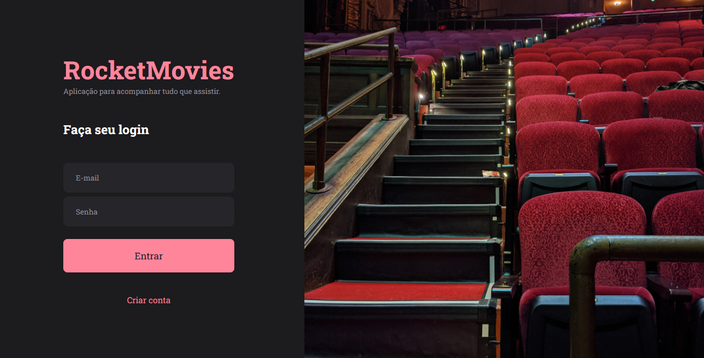

<h1 align="center">Rocketmovies</h1>

 O Explorer é um programa completo que reúne tudo o que você precisa para iniciar no mundo da programação Web, te auxiliando a desenvolver suas habilidades técnicas e comportamentais, para que você alcance sua primeira vaga no mercado de programação. 

  <a href="#-tecnologias">Tecnologias</a>&nbsp;&nbsp;&nbsp;|&nbsp;&nbsp;&nbsp;
  <a href="#-projeto">Projeto</a>&nbsp;&nbsp;&nbsp;|&nbsp;&nbsp;&nbsp;
  <a href="#-layout">Layout</a>&nbsp;&nbsp;&nbsp;|&nbsp;&nbsp;&nbsp;
  <a href="#memo-licença">Licença</a>

  

 

  

 

## 🚀 Tecnologias

Esse projeto foi desenvolvido com as seguintes tecnologias:

- React
- CSS
- Vite
- Figma

 
## 💻 Projeto

Desenvolver uma aplicação chamada "Rocket Movies", aplicação destinada a gerenciamento dos filmes dos usuários. Onde após o usuário se cadastrar e logar, pode cadastrar, visualizar seus filmes com nota e tags relacionadas. Também pode realizar a atualização dos dados do usuário, assim como inserir uma imagem. 

- [Visite o projeto]()

 
## 🔖 Layout

O layout do projeto encontra-se no Figma e você pode ter acesso através [DESSE LINK](https://www.figma.com/file/IGGeUjjgZfud5hlpr60WSf/RocketMovies-(Copy)?node-id=0%3A1&mode=dev).

 
## 🔒 Layout

Esse projeto está sob a licença MIT.